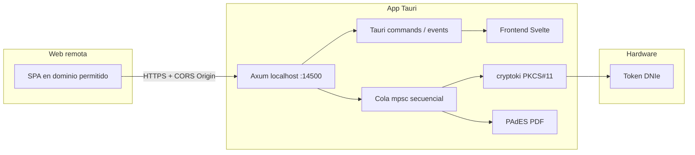

# Plan: NexoSign — Entorno, DNIe/PKCS#11, firma PAdES masiva y distribución

**Nombre del producto**: **NexoSign** (nombre comercial; el identificador técnico del paquete puede ser `nexosign` en npm/Cargo/bundle para coherencia con deep links y tiendas).

Contexto: el proyecto NexoSign ya tiene cascarón Tauri + SvelteKit en el repo; las fases siguientes amplían backend y funcionalidad.

## Arquitectura mental

**Decisiones base recomendadas** (ajustables al crear el proyecto):

| Área                     | Elección sugerida                                        | Motivo breve                                                                       |
| ------------------------ | -------------------------------------------------------- | ---------------------------------------------------------------------------------- |
| Frontend                 | **Svelte** + TypeScript + Vite                           | UI ligera y acorde al stack elegido para NexoSign                                  |
| Servidor local           | **Axum** + `tower-http` (CORS)                           | Mantenimiento activo, integración típica con Tokio                                 |
| PKCS#11                  | **`cryptoki`**                                           | Wrapper oficial sobre PKCS#11 en Rust                                              |
| Estado persistido de ACL | **SQLite** vía `rusqlite` o `sqlx`                       | Consultas y auditoría de dominios permitidos; misma lista alimenta CORS en runtime |
| CORS localhost           | **Orígenes dinámicos** (`AllowOrigin::predicate` + estado compartido) | No hardcodear solo en compile-time; recargar al cambiar config o tras aprobar origen |
| PDF PAdES                | Combinar crate PDF (`lopdf`, `pdf`) + estándar CMS/PAdES | La parte PAdES es la más delicada: valorar crate especializado o FFI si hace falta |

---

## Fase 1: Entorno y arquitectura base

**1.1 Crear el cascarón Tauri**

- El repo ya incluye **Tauri 2 + SvelteKit + TypeScript** (`nexosign` / **NexoSign**).
- Próximo paso: añadir dependencias Rust (**tokio**, **axum**, **tower-http**, **tracing**) según [`src-tauri/Cargo.toml`](src-tauri/Cargo.toml).

**1.2 Dependencias Rust (`src-tauri/Cargo.toml`)**

- **Runtime**: `tokio` con features `full` o `rt-multi-thread`, `macros`, `sync`.
- **Servidor**: `axum`, `tower`, `tower-http` (CORS).
- **IPC con frontend**: APIs nativas de Tauri v2 (`emit`, `listen`) desde comandos/`ManagedState`; el servidor Axum puede vivir en una tarea Tokio spawn desde `setup` en [`src-tauri/src/lib.rs`](src-tauri/src/lib.rs).
- **PKCS#11**: `cryptoki` (Fase 2).
- Opcional temprano: `tracing` / `tracing-subscriber` para depurar el servidor y la cola.

**1.3 Servidor local en puerto 14500**

- Un único `Router` Axum que escuche `127.0.0.1:14500`.
- Endpoints mínimos de Fase 1: `GET /health`, `POST /api/...` (stub) para validar CORS y eventos.
- **CORS dinámico y configurable**:
  - **Sí**, el origen puede ser dinámico: en `tower-http`, usar `CorsLayer` con `AllowOrigin::predicate` que consulte un **`Arc<RwLock<Vec<Origin>>>`** (o `Vec<String>` normalizadas a esquema + host + puerto).
  - **Fuentes de la lista**: (1) archivo de config local / variables de entorno al arranque; (2) en Fase 4, **la misma tabla SQLite** de orígenes aprobados — al persistir o revocar un origen, actualizar el estado en memoria para que el predicado CORS refleje el cambio **sin reiniciar** el servidor.
  - **Defaults de desarrollo**: incluir `http://localhost:1420` (puerto del frontend en este proyecto con Tauri).
  - No usar `*` si envías credenciales o cabeceras sensibles; el predicado debe comparar el header `Origin` de forma estricta (y considerar peticiones sin `Origin`, p. ej. herramientas tipo `curl`, según política).
- La **autorización fuerte** (diálogo nativo antes de confiar en un origen nuevo) sigue siendo Fase 4; CORS es la primera línea y debe permanecer alineada con lo guardado en disco.

**1.4 Mensajería en tiempo real**

- Patrón: el backend Rust emite eventos Tauri (`app.emit("progreso", payload)`) cuando la cola avance (stub en Fase 1).
- Frontend: `listen` al canal `progreso` y actualizar estado (runas/stores Svelte según plantilla).

---

## Fase 2: Capa de hardware (Rust + PKCS#11)

**2.1 Descubrimiento del driver (.dll / .so / .dylib)**

- Función única, por ejemplo `resolve_dn_ie_pkcs11_path() -> Result<PathBuf>`:
  - **Windows**: rutas típicas del middleware DNIe / FNMT (registro de instalación o directorios conocidos); parametrizar vía variable de entorno o archivo de config local para no hardcodear solo una versión.
  - **Linux**: `/usr/lib/...`, paquetes `opensc`, etc.
  - **macOS**: `pkcs11.dylib` del proveedor o OpenSC si aplica.
- Cargar la biblioteca y obtener función `C_GetFunctionList` vía `cryptoki` según documentación del crate.

**2.2 Enumeración de certificados**

- Tras `C_Initialize` / abrir slot: listar objetos con clase `CKO_CERTIFICATE`.
- **Filtrado “solo firma”**: usar extensiones / `CKA_ID` asociado a clave privada y revisar **Key Usage** (digitalSignature / nonRepudiation) y políticas del DNIe; excluir certificados con uso solo `clientAuth` o equivalentes de autenticación. Mantener tests unitarios con certificados PEM de prueba si es posible.

**2.3 Sesión y PIN (caching)**

- Flujo `login(pin)`:
  - `C_OpenSession` en el slot correcto.
  - `C_Login` con `CKU_USER`; mantener la sesión abierta en un **estado compartido** (`Arc<Mutex<...>>` o tipo dedicado) con tiempo de vida definido (timeout configurable).
  - Para lotes: **un solo login** por lote o hasta idle timeout; documentar riesgo de dejar PIN “caliente” en sesión PKCS#11 y mitigar con bloqueo de pantalla / cierre de sesión al cancelar.

---

## Fase 3: Motor de firma masiva (batch)

**3.1 Cola secuencial obligatoria**

- `tokio::sync::mpsc` (o `mpsc` + `Mutex` para el worker): un **único** consumidor que ejecute operaciones PKCS#11 en serie.
- API HTTP que **encola** `{ job_id, lista de paths o hashes }` y responde inmediatamente con `job_id`; el progreso va por eventos Tauri.

**3.2 PAdES (alto nivel)**

- **Extracción de hash**: preparación del **SignedAttributes** según PAdES-BES; hash SHA-256 sobre la porción correcta del PDF (ByteRange).
- **Firma con DNIe**: operación de firma RSA/ECDSA en el token vía PKCS#11 (`C_SignInit` / `C_Sign` o mecanismo del proveedor) sobre el **digest** que exija el estándar CMS.
- **Inserción en PDF**: reescritura del PDF con diccionario de firma, ByteRange y contenido PKCS#7/CMS.

Nota de planificación: si la implementación pura Rust resulta costosa, valorar **biblioteca específica PAdES** mantenida o capa intermedia.

**3.3 Reportería**

- Tras cada documento: `emit("progreso", { actual, total, job_id, nombre_archivo?, error? })`.
- Errores por archivo no deben tumbar todo el lote salvo política explícita “abort on first error”.

---

## Fase 4: Seguridad y UX

**4.1 Autorización de origen (más allá de CORS)**

- En cada nueva combinación **Origin** (o host de referencia) que intente usar endpoints sensibles:
  - Bloquear hasta que el usuario apruebe en **diálogo nativo** Tauri (`MessageDialog` / `ask`).
  - Persistir decisión en **SQLite** (tabla `allowed_origins`: origin, permitido, fecha).
  - **Sincronizar con CORS**: tras guardar o eliminar un origen, notificar al servidor Axum para **actualizar la lista en memoria** usada por `AllowOrigin::predicate` (un solo origen de verdad: disco + capa CORS).
  - Opcional: pantalla de **ajuste manual** en la app para añadir/quitar orígenes (misma persistencia + refresco CORS).
  - Alternativa mencionada: JSON cifrado con `age` o `libsodium`; SQLite suele ser más simple para consultas.

**4.2 UI de firma masiva**

- Vista dedicada al recibir orden desde web (vía deep link o primer request que dispare navegación interna):
  - Lista de archivos en proceso / completados / fallidos.
  - Barra de progreso (lineal + opción circular con CSS/SVG).
  - Botón **Cancelar lote**: señal a la cola (`cancel_token` de Tokio) y cierre ordenado de sesión si aplica.

**4.3 Deep linking**

- Registrar esquema personalizado **`nexosign://`** (minúsculas, sin espacios; revisar reserva de nombres en macOS/Windows) en `tauri.conf.json` (bundle macOS/Windows) y usar plugin **deep-link** de Tauri v2 para “despertar” NexoSign y pasar parámetros (por ejemplo `job` o `return_url`).
- Coordinar con la web: enlaces `nexosign://sign?...` (o path acordado) tras login en portal. Si el nombre comercial cambia, mantener **un solo** esquema estable en producción o documentar migración y ventana de compatibilidad.

---

## Fase 5: Pruebas y empaquetado

**5.1 Prueba de carga**

- Generar o usar 100 PDFs ~10 MB (script fuera de la app o fixtures).
- Medir tiempos por firma, ajustar **timeouts** en cliente HTTP y en sesión PKCS#11; revisar memory usage al leer PDFs grandes (streaming / mmap si hace falta).

**5.2 Windows (.msi)**

- Configurar `tauri build`, firma de código si tienes certificado, instalador MSI desde configuración de Tauri bundler.

**5.3 macOS Notarization**

- Flujo estándar Apple: **Developer ID Application** → `codesign` → `notarytool submit` → `stapler staple`.
- Documentar en README interno: credenciales en CI (secrets), hardened runtime, entitlements si abres drivers PKCS#11 o keychain.

---

## Orden de trabajo recomendado

1. Fase 1 completa (app arranca, localhost responde, eventos stub).
2. Fase 2 con hardware real o simulador PKCS#11 (SoftHSM) para CI sin token.
3. Fase 3 con PDFs de prueba pequeños primero, luego tamaño 10 MB.
4. Fase 4 en paralelo cuando la cola sea estable.
5. Fase 5 al cerrar funcionalidad core.

---

## Riesgos y dependencias externas

- **PAdES** es la pieza con mayor complejidad normativa/técnica; conviene acotar perfil PAdES (p. ej. PAdES-BES) en el primer entregable.
- **DNIe** depende de drivers y versión de SO; el plan debe incluir matriz de prueba (Windows 10/11, macOS versiones soportadas).
- **Seguridad**: el puerto local solo en loopback reduce superficie; la autorización por diálogo evita que sitios arbitrarios abusen del bridge.
