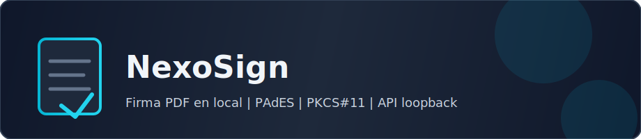
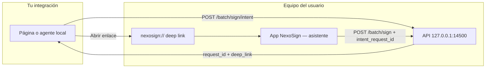

<div align="center">

<div style="display:flex; flex-wrap:wrap; gap:8px; justify-content:center; align-items:center;">
<a href="https://tauri.app/"></a>
<a href="https://www.rust-lang.org/"></a>
<a href="https://kit.svelte.dev/"></a>
<a href="https://www.typescriptlang.org/"></a>
<a href="./package.json"></a>
</div>

<br/>



<br/>

<div align="center" style="display:flex; flex-wrap:wrap; gap:12px 18px; justify-content:center; align-items:center; margin:12px 0;">
<strong>🔐 Local</strong>
<strong>📄 PAdES</strong>
<strong>🔌 PKCS#11</strong>
<strong>🌐 API loopback</strong>
<strong>🔗 Deep links</strong>
</div>

<div align="center" style="display:flex; flex-wrap:wrap; gap:10px 20px; justify-content:center; align-items:center;">
<a href="#-api-local--referencia-rápida">Ficha técnica</a>
<span aria-hidden="true">·</span>
<a href="#-integración-externa--portal-y-escritorio">Integración</a>
<span aria-hidden="true">·</span>
<a href="./CONTRIBUTING.md">Contribuir</a>
</div>

</div>

---

## ✨ Por qué NexoSign

| | |
|:---|:---|
| 🔒 **Privacidad por diseño** | La firma y el PIN ocurren **en el equipo del usuario**. La API solo escucha en **loopback** — no es un SaaS que centralice tus PDF ni tus claves. |
| 🖲️ **Hardware real** | PKCS#11: mismo modelo que **DNIe**, tarjetas y HSM. **Una cola, un firmador**: el paralelismo no rompe lo que el chip no permite. |
| 🧩 **Tu web, el escritorio** | Desde el navegador puedes registrar una **intención** (`POST …/intent`), recibir un **`deep_link`** y abrir la app con **`nexosign://`** para que el usuario **complete el asistente** (certificado, PIN, casilla). |
| ⚙️ **Automatización local** | Cuando la política lo permite, **`POST /api/v1/batch/sign`** encola el lote **en un solo paso** con rutas absolutas y PIN opcional. |

---

## 🎯 Experiencia en la app

1. **Origen** — PDF sueltos o **carpeta completa** (todos los `.pdf`, también en subcarpetas). Carpeta → salida en **`NombreCarpeta_firmados`** junto a la carpeta elegida.
2. **Certificado** — Eliges entre certificados de **firma** detectados vía PKCS#11.
3. **PIN** — Solo para desbloquear el token en esa operación; **sin** sesión PKCS#11 prolongada por tiempo.
4. **Ubicación y confirmar** — Rejilla en primera página, cola local y seguimiento del lote.

📁 **Salida:** `{nombre}_firmado.pdf` junto al original o dentro de `…_firmados` si firmaste por carpeta.

---

## 🛰️ API local — referencia rápida

La API está en **`http://127.0.0.1:14500`** **solo con la aplicación en ejecución** (`npm run tauri dev` o binario instalado).

| Requisito | Detalle |
|-----------|---------|
| 🌍 **Origen** | Los `POST` de batch en navegador necesitan cabecera **`Origin`** permitida por CORS (p. ej. `http://localhost:1420`). |
| 💻 **`curl`** | Añade `-H "Origin: http://localhost:1420"` como en los ejemplos. |
| 📂 **Rutas** | `inputs` y `output_dir` deben ser **absolutas** y existir en el **mismo equipo** donde corre NexoSign. |

| Endpoint | Rol |
|----------|-----|
| **`POST /api/v1/batch/sign`** | Encola **de inmediato**. Body: `cert_id_hex`, `inputs`, opcional `job_id`, **`pin`**, **`output_dir`**, **`signature_grid`** (rejilla 7×5 en la primera página), **`intent_request_id`** si viene de una intención. → `{ job_id, queued: true }`. |
| **`POST /api/v1/batch/sign/intent`** | **No firma aún.** Registra rutas para el asistente; responde **`request_id`** + **`deep_link`** (`nexosign://sign?intent=…`). TTL ~30 min en memoria. |
| **`GET /health`** | Estado del servicio (sin `Origin`). |
| **`POST /api/v1/ping`** | Eco para pruebas. |
| **`NEXOSIGN_BATCH_OUTPUT_DIR`** | Variable de entorno: fuerza carpeta de salida global `{stem}_firmado.pdf`. |

---

## 🔗 Integración externa — portal y escritorio

Cuando el usuario **debe** elegir certificado y PIN **en la app** (no en un POST invisible desde tu servidor).



**Pasos**

1. Los PDF están **en disco** en ese PC (rutas absolutas).
2. Tu cliente llama **`POST /api/v1/batch/sign/intent`** con esas rutas.
3. Recibes **`request_id`** y **`deep_link`** — úsalos en un botón del tipo **«Abrir en NexoSign»**.
4. El sistema operativo abre la app registrada para **`nexosign://`** (en desarrollo a veces conviene lanzar la app manualmente).
5. El usuario completa el asistente; al confirmar, la app llama **`POST /api/v1/batch/sign`** con **`intent_request_id`** igual al **`request_id`** recibido.

> **Producto:** el resultado de la firma **no** regresa por el mismo HTTP que disparó el deep link; el proceso es **asíncrono** entre portal y app. Podéis combinar mensajes en UI, polling propio o callbacks cuando exista backend intermedio.

<details>
<summary><strong>📋 Ejemplo — registrar intención</strong></summary>

```bash
curl -sS -X POST "http://127.0.0.1:14500/api/v1/batch/sign/intent" \
  -H "Content-Type: application/json" \
  -H "Origin: http://localhost:1420" \
  -d "{\"inputs\": [\"/Users/tu/usuario/documentos/doc.pdf\"]}"
```

```json
{
  "request_id": "f47ac10b-58cc-4372-a567-0e02b2c3d479",
  "deep_link": "nexosign://sign?intent=f47ac10b-58cc-4372-a567-0e02b2c3d479"
}
```

</details>

<details>
<summary><strong>📋 Ejemplo — encolar tras confirmar en la UI</strong> (referencia; la app rellena PIN en producción)</summary>

```bash
curl -sS -X POST "http://127.0.0.1:14500/api/v1/batch/sign" \
  -H "Content-Type: application/json" \
  -H "Origin: http://localhost:1420" \
  -d "{
    \"cert_id_hex\": \"ABCDEF…\",
    \"inputs\": [\"/Users/tu/usuario/documentos/doc.pdf\"],
    \"job_id\": \"mi-trabajo-1\",
    \"pin\": \"****\",
    \"intent_request_id\": \"f47ac10b-58cc-4372-a567-0e02b2c3d479\",
    \"signature_grid\": { \"col\": 3, \"row\": 4 }
  }"
```

</details>

### Batch directo (sin intención)

En la misma máquina y con política que lo permita: **`POST /api/v1/batch/sign`** con todo en un solo JSON — ideal para **scripts y automatización local**; no sustituye el flujo con intención cuando buscas una UX guiada y trazable.

---

## 🧱 Capacidades técnicas

| | |
|:---|:---|
| 📜 **PAdES-BES** | CMS detached + RSA en token. |
| 🛡️ **CORS** | Lista de orígenes alineada con la política en app / SQLite. |
| 📊 **`progreso`** | Eventos IPC por documento para barras y logs. |
| 🔑 **PKCS#11** | Descubrimiento de módulos, certificados de firma, sesión acotada. |
| 🔐 **PIN** | En batch por loopback o comandos `pkcs11_login` / `pkcs11_logout` según flujo. |

---

## 💳 PKCS#11 / DNIe

| Variable | Uso |
|----------|-----|
| `NEXOSIGN_PKCS11_MODULE` | Ruta absoluta al `.dll` / `.so` / `.dylib` (prioridad sobre rutas por defecto). |
| `NEXOSIGN_PKCS11_SLOT` | Índice del slot (`0` por defecto). |

Si el DNIe funciona en el navegador del sistema pero NexoSign muestra **0 slots**, suele ser **middleware PKCS#11 distinto**: prueba el del **proveedor oficial del DNIe** (FNMT/CCN) con `NEXOSIGN_PKCS11_MODULE`. OpenSC a veces no expone la tarjeta aunque el USB sí esté reconocido.

---

## 📦 Prerrequisitos

- [Node.js](https://nodejs.org/) (LTS)
- [Rust](https://www.rust-lang.org/tools/install) y [prerrequisitos Tauri](https://v2.tauri.app/start/prerequisites/)

## 🚀 Desarrollo

```bash
npm install
npm run tauri dev
```

| Servicio | URL |
|----------|-----|
| Frontend | **`http://localhost:1420`** |
| API | **`http://127.0.0.1:14500`** |

### Orígenes extra (CORS)

```bash
export NEXOSIGN_ALLOWED_ORIGINS="https://mi-app.example,http://localhost:3000"
npm run tauri dev
```

Por defecto: `localhost` / `127.0.0.1` en puertos **1420** (Tauri+Vite) y **5173**.

---

## ✅ Pruebas

| Capa | Comando | Valida |
|------|---------|--------|
| Dominio Rust | `cargo test -p nexosign --lib domain` | Política de orígenes |
| HTTP | `cargo test -p nexosign --lib adapters::http` | Batch, intent, CORS |
| Contrato | `cargo test -p nexosign --test http_contract` | Router sin proceso OS |
| Cliente TS | `npm run test` | Vitest |
| E2E UI | `npm run test:e2e` | Playwright |
| E2E API | Terminal A: `npm run tauri dev` · B: `NEXOSIGN_E2E_API=1 npm run test:e2e` | Contrato contra API real |

Sin servidor en `:14500`, los E2E que llaman a red **se omiten** (no fallan).

Primera vez: `npx playwright install chromium`.

```bash
npm run test
npm run test:e2e
cargo test --manifest-path src-tauri/Cargo.toml
```

---

## 🤝 Contribuir

Las convenciones de código y el flujo de PR están en **[`CONTRIBUTING.md`](./CONTRIBUTING.md)**. La arquitectura detallada vive en **`AGENTS.md`**.

---

## 🛠️ IDE recomendado

[VS Code](https://code.visualstudio.com/) · [Svelte](https://marketplace.visualstudio.com/items?itemName=svelte.svelte-vscode) · [Tauri](https://marketplace.visualstudio.com/items?itemName=tauri-apps.tauri-vscode) · [rust-analyzer](https://marketplace.visualstudio.com/items?itemName=rust-lang.rust-analyzer)
