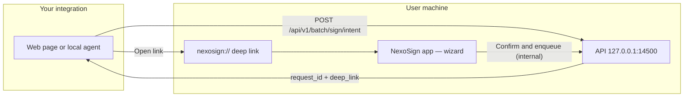

<div align="center">

<div style="display:flex; flex-wrap:wrap; gap:8px; justify-content:center; align-items:center;">
<a href="https://tauri.app/"></a>
<a href="https://www.rust-lang.org/"></a>
<a href="https://kit.svelte.dev/"></a>
<a href="https://www.typescriptlang.org/"></a>
<a href="https://github.com/cjuriartec/nexosign/releases"></a>
<a href="./LICENSE"></a>
</div>

<br/>


<br/>

<div align="center" style="display:flex; flex-wrap:wrap; gap:12px 18px; justify-content:center; align-items:center; margin:12px 0;">
<strong>🔐 Local</strong>
<strong>📄 PAdES</strong>
<strong>🔌 PKCS#11</strong>
<strong>🌐 API loopback</strong>
<strong>🔗 Deep links</strong>
</div>

<div align="center" style="display:flex; flex-wrap:wrap; gap:10px 20px; justify-content:center; align-items:center;">
<a href="#local-api--quick-reference">API</a>
<span aria-hidden="true">·</span>
<a href="#external-integration--portal-and-desktop">Integration</a>
<span aria-hidden="true">·</span>
<a href="./CONTRIBUTING.md">Contributing</a>
</div>

</div>

---

## Installation

Download the latest **Windows** installer from **[Releases](https://github.com/cjuriartec/nexosign/releases)**. Prefer **`NexoSign_*_x64-setup.exe`** (per-user, no admin required). The **`.msi`** is for system-wide / IT installs and typically asks for administrator rights.

- **macOS** bundles from CI are **not notarized**; see [`docs/distribucion-macos.md`](./docs/distribucion-macos.md).
- **Development** setup: [CONTRIBUTING.md](./CONTRIBUTING.md).

## Project governance

| Document | Purpose |
| -------- | ------- |
| [LICENSE](./LICENSE) | MIT |
| [SECURITY.md](./SECURITY.md) | Vulnerability reporting |
| [CODE_OF_CONDUCT.md](./CODE_OF_CONDUCT.md) | Community standards |
| [CHANGELOG.md](./CHANGELOG.md) | Release history |

Internal planning notes: [`docs/internal/PLAN.md`](./docs/internal/PLAN.md).

---

## Why NexoSign

| | |
|:---|:---|
| 🔒 **Privacy by design** | Signing and the PIN happen **on the user’s machine**. The API listens on **loopback only** — not a SaaS that stores your PDFs or keys. |
| 🖲️ **Real hardware** | PKCS#11: same model as **smart cards**, Spanish DNIe, and HSMs. **One queue, one signer**: parallelism must not break what the chip cannot do. |
| 🧩 **Your web, the desktop** | From the browser you can register an **intent** (`POST …/intent`), get a **`deep_link`**, and open the app via **`nexosign://`** so the user **completes the wizard** (certificate, PIN, stamp cell). |
| ⚙️ **Local automation** | The **desktop app** and tools on the same machine may use internal HTTP routes not in OpenAPI; remote integrators use **intent → status → downloads**. |

---

## App workflow

1. **Source** — Individual PDFs or an entire **folder** (all `.pdf` files, including subfolders). Folder signing writes output to **`FolderName_signed`** next to the chosen folder.
2. **Certificate** — Pick from **signing** certificates discovered via PKCS#11 (and Windows MY on Windows).
3. **PIN** — Only to unlock the token for that operation; **no** long-lived PKCS#11 session.
4. **Placement and confirm** — Grid on the first page, local queue, and batch progress.

📁 **Output:** `{name}_signed.pdf` next to the original, or inside `…_signed` when signing by folder.

**Background:** closing the window does **not** quit the app (local API and deep links stay active). Restore the window from the **system tray** (**Open NexoSign**) or by opening a **`nexosign://…`** link. To exit completely, use **Quit** in the tray or the application menu (e.g. Cmd+Q on macOS).

---

## Local API — quick reference

The API listens at **`http://127.0.0.1:14500`** **only while the app is running** (`npm run tauri dev` or an installed build).

**Desktop app:** the UI uses Tauri **`invoke`** (`local_api_*` Rust commands) for health, ping, enqueue signing, and job status — same logic as the HTTP endpoints, without `fetch` to loopback (avoids CORS and mixed-content issues in release). **`127.0.0.1:14500`** remains the channel for **integrators**, portals, and external tools.

| Requirement | Details |
|-------------|---------|
| 🌍 **Origin** | Browser **`POST` and `GET`** for batch routes need an **`Origin`** header allowed by CORS (e.g. `http://localhost:1420`). Includes intent status polling and downloads. |
| 💻 **`curl`** | Add `-H "Origin: http://localhost:1420"` as in the examples. |
| 📘 **OpenAPI** | With the app running: **`GET /openapi.json`** — intent, intent status, batch downloads, **`GET /health`**, **`POST /api/v1/ping`**. **`GET /docs`** serves **Swagger UI**. Import into [Scalar](https://scalar.com), Postman, etc. |
| 📂 **Multipart vs signing** | **`multipart/form-data`** only on **`POST …/batch/sign/intent`** (upload PDFs from the browser). Signing runs in the **app** after the deep link; that step is **not** in **`openapi.json`** (web integrator contract). |

| Endpoint | Role |
|----------|------|
| **`GET /api/v1/batch/jobs/{job_id}/signed-files`** | When the batch **has finished**: JSON with `files[]` (`index`, `filename`, `href`) to download each signed PDF **from the browser** (same **Origin** as POST). |
| **`GET /api/v1/batch/jobs/{job_id}/files/{i}`** | **`application/pdf`** for signed file *i* (same order as `inputs` / successful items only). |
| **`GET /api/v1/batch/sign/intent/{request_id}/status`** | **Poll** after intent: `phase` = `awaiting_confirmation` \| `processing` \| `completed`, `job_id`, `manifest_href`, `signed_file_count`. No backend required: your page polls `127.0.0.1:14500` with the same **Origin**. |
| **`POST /api/v1/batch/sign/intent`** | **Does not sign yet.** **`application/json`** (`inputs`: absolute paths) **or** **`multipart/form-data`** with repeatable **`files`** (one PDF per part). Uploads go to temporary staging; returns **`request_id`** + **`deep_link`**. Expires if not confirmed in time (same window as max batch job time; default ~5 min, set via `NEXOSIGN_BATCH_JOB_MAX_SECS`). |
| **`GET /health`** | Service status (no `Origin`). |
| **`POST /api/v1/ping`** | Echo for smoke tests. |
| **`NEXOSIGN_BATCH_OUTPUT_DIR`** | Env var: force global output folder `{stem}_signed.pdf`. |
| **`NEXOSIGN_BATCH_JOB_MAX_SECS`** | Max window (seconds) for pending intents and queued batch jobs (default **300**). Large batches or load tests: increase (e.g. **7200**). |

---

## External integration — portal and desktop

Use this when the user **must** pick certificate and PIN **in the app** (not via a hidden POST from your server).



**Steps**

1. **JSON:** PDFs are already **on disk** (absolute paths) on that PC.
2. **Multipart:** the browser sends PDFs in repeatable **`files`** (up to 20 PDFs, 50 MiB each, total cap 20×50 MiB); the API stages temporaries and the wizard treats them as batch inputs.
3. Your client calls **`POST /api/v1/batch/sign/intent`** (JSON or multipart).
4. You receive **`request_id`** and **`deep_link`** — use them in an **“Open in NexoSign”** button.
5. The OS opens the app registered for **`nexosign://`** (in dev you may need to start the app manually).
6. The user completes the wizard; on confirm, **NexoSign** enqueues signing **locally** and links the intent **`request_id`** to the job (`job_id`) for polling and downloads; staging is **removed** when the batch finishes.

### Portal without your own backend (HTML/JS on your domain only)

No HTTP callback to your server is required. With the intent **`request_id`**:

1. Open the **`deep_link`** to launch NexoSign.
2. From the same tab (origin already allowed in Settings), **poll** every few seconds:  
   `GET http://127.0.0.1:14500/api/v1/batch/sign/intent/{request_id}/status`  
   with **`Origin`** (your portal’s origin).
3. When **`phase`** is **`completed`**, use **`manifest_href`** (or **`job_id`**) for  
   `GET …/batch/jobs/{job_id}/signed-files`, then each **`GET …/files/{i}`**, and save blobs in the client.

Until then you will see **`awaiting_confirmation`** (intent open) or **`processing`** (job queued, signing in progress).

> **Note:** without an intermediate backend, polling is always to **loopback** from the user’s browser (same machine as NexoSign).

> **Product note:** portals previously could not learn `job_id`; the **status** endpoint completes that flow.

> **`GET /openapi.json`** covers intent, intent status, batch downloads, **`GET /health`**, and **`POST /api/v1/ping`** (integrator contract). Routes like **`POST /api/v1/batch/sign`** (direct enqueue with PIN) are for same-machine app use and **do not** appear in that JSON.

<details>
<summary><strong>📋 Example — intent uploading PDF (multipart)</strong></summary>

```bash
curl -sS -X POST "http://127.0.0.1:14500/api/v1/batch/sign/intent" \
  -H "Origin: http://localhost:1420" \
  -F "files=@/Users/tu/usuario/documentos/doc.pdf;type=application/pdf"
```

</details>

<details>
<summary><strong>📋 Example — intent with local paths (JSON)</strong></summary>

```bash
curl -sS -X POST "http://127.0.0.1:14500/api/v1/batch/sign/intent" \
  -H "Content-Type: application/json" \
  -H "Origin: http://localhost:1420" \
  -d "{\"inputs\": [\"/Users/tu/usuario/documentos/doc.pdf\"]}"
```

</details>

```json
{
  "request_id": "f47ac10b-58cc-4372-a567-0e02b2c3d479",
  "deep_link": "nexosign://sign?intent=f47ac10b-58cc-4372-a567-0e02b2c3d479"
}
```


### Outside the public OpenAPI surface

The desktop app and other **local** processes may use additional loopback HTTP routes; they are **not** in **`openapi.json`**. For integration from your domain, stick to **intent → status polling → downloads**.

---

## Technical capabilities

| | |
|:---|:---|
| 📜 **PAdES-BES** | Detached CMS + RSA on token. |
| 🛡️ **CORS** | Allowed origins aligned with in-app policy / SQLite. |
| 📊 **`progreso`** | IPC events per document for progress bars and logs. |
| 🔑 **PKCS#11** | Module discovery, signing certificates, bounded session. |
| 🔐 **PIN** | Batch via loopback or `pkcs11_login` / `pkcs11_logout` commands depending on flow. |

---

## PKCS#11 / smart cards

| Variable | Purpose |
|----------|---------|
| `NEXOSIGN_PKCS11_MODULE` | Absolute path to `.dll` / `.so` / `.dylib` (overrides default paths). |
| `NEXOSIGN_PKCS11_SLOT` | Slot index (default `0`). |
| `NEXOSIGN_BATCH_JOB_MAX_SECS` | Max time (seconds) for pending intents and batch queue in SQLite (default **300**). |

If DNIe works in the system browser but NexoSign shows **0 slots**, you often need **different PKCS#11 middleware**: try the **official DNIe provider** (FNMT/CCN) with `NEXOSIGN_PKCS11_MODULE`. OpenSC sometimes does not expose the card even when USB is recognized.

### Windows store (MY) and .pfx

On **Windows**, besides PKCS#11, NexoSign lists **signing** certificates from the **Personal (MY)** store with **RSA CNG** keys (merged into the same list as the token). IDs start with `winmy:` + SHA-1 thumbprint. The UI indicates whether a PIN is required in-app or signing delegates to Windows Credential Manager (see **[`docs/certificados-pkcs11-y-windows.md`](./docs/certificados-pkcs11-y-windows.md)**).

A **`.pfx` on disk only** or **imported to the store without RSA CNG** may not appear or may not sign in this flow. **PKCS#11 middleware** or hardware with its `.dll` remains the supported path.

### Packaging (MSI / macOS notarization)

Guides: **[`docs/distribucion-windows.md`](./docs/distribucion-windows.md)** and **[`docs/distribucion-macos.md`](./docs/distribucion-macos.md)**.

### Load testing (sample PDFs)

See **[`scripts/load-test/README.md`](./scripts/load-test/README.md)** and **`scripts/gen-load-test-pdfs.mjs`**.

---

## Prerequisites

- [Node.js](https://nodejs.org/) (LTS)
- [Rust](https://www.rust-lang.org/tools/install) and [Tauri prerequisites](https://v2.tauri.app/start/prerequisites/)

## Development

```bash
npm install
npm run tauri dev
```

| Servicio | URL |
|----------|-----|
| Frontend | **`http://localhost:1420`** |
| API | **`http://127.0.0.1:14500`** |

### Extra origins (CORS)

```bash
export NEXOSIGN_ALLOWED_ORIGINS="https://my-app.example,http://localhost:3000"
npm run tauri dev
```

Defaults: `localhost` / `127.0.0.1` on ports **1420** (Tauri+Vite) and **5173**.

---

## Tests

| Layer | Command | Validates |
|-------|---------|-----------|
| Rust domain | `cargo test -p nexosign --lib domain` | Origin policy |
| HTTP | `cargo test -p nexosign --lib adapters::http` | Batch, intent, CORS |
| Contract | `cargo test -p nexosign --test http_contract` | Router without OS process |
| TS client | `npm run test` | Vitest |
| E2E UI | `npm run test:e2e` | Playwright |
| E2E API | Terminal A: `npm run tauri dev` · B: `NEXOSIGN_E2E_API=1 npm run test:e2e` | Contract against live API |

Without a server on `:14500`, network E2E tests are **skipped** (not failed).

First time: `npx playwright install chromium`.

```bash
npm run test
npm run test:e2e
cargo test --manifest-path src-tauri/Cargo.toml
```

---

## Contributing

See **[CONTRIBUTING.md](./CONTRIBUTING.md)** for setup, conventions, and pull requests. Architecture details: **[AGENTS.md](./AGENTS.md)**.

---

## Recommended IDE

[VS Code](https://code.visualstudio.com/) · [Svelte](https://marketplace.visualstudio.com/items?itemName=svelte.svelte-vscode) · [Tauri](https://marketplace.visualstudio.com/items?itemName=tauri-apps.tauri-vscode) · [rust-analyzer](https://marketplace.visualstudio.com/items?itemName=rust-lang.rust-analyzer)
